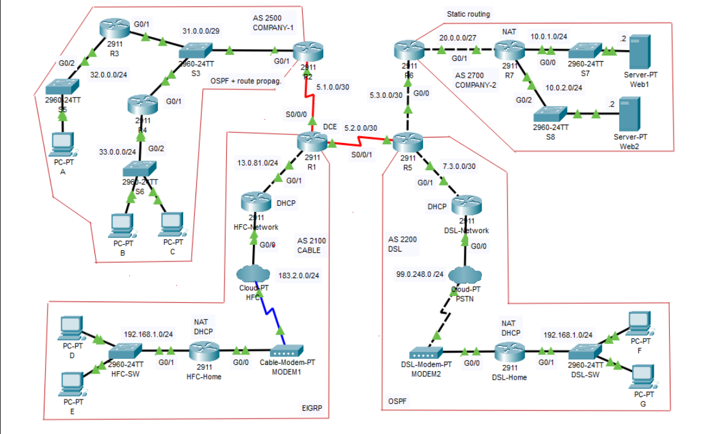

# CISCO PACKET TRACER NETWORKING LAB
In this project i will be using cisco packet tracer to simulate a physical network and apply the networking concepts i have learned.

The networking concepts that I will apply in this lab include:
 - Router Configuration
 - DHCP
 - NAT (Network Address Translation)
 - Routing Protocols (OSPF, BGP, Static Routing, EIGRP and default routes)
 - ACL's (Access Control Lists)

# Designing The Topology
As you can see from   here is the layout of the topology I will be configuring.
It consists of 11 routers, 7 switches, 7 PC's and 2 web servers, i will be configuring everything on the network to be able to communicate with each other. 

